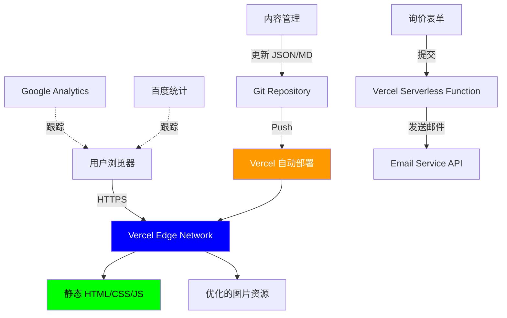

# 设计文档

## 概述

本设计文档描述了一个高性能、低成本的域名销售网站的技术架构和实现方案。该网站将使用现代静态站点生成技术，部署在免费的边缘网络平台上，通过极致的 SEO 优化和用户体验设计来吸引潜在买家并促进域名销售转化。

核心设计原则：
- **极简架构**：静态站点生成，零后端依赖
- **极致性能**：边缘部署，全球 CDN 加速
- **极低成本**：免费托管平台，年成本 < $50
- **极高质量**：现代设计，专业体验
- **SEO 优先**：针对 Google 和百度的深度优化

## 架构

### 技术栈选择

**前端框架：Astro 4+**
- 理由：
  - **极简架构**：默认零 JavaScript，只在需要时加载
  - **极致性能**：比 Next.js 更快的构建和加载速度
  - **极低成本**：更小的包体积，更少的资源消耗
  - **极高质量**：内置优化，自动图片处理
  - **简单易维护**：更少的抽象层，更直观的代码结构
  - 支持 React/Vue/Svelte 组件（按需使用）
  - 优秀的 SEO 支持和静态站点生成
  - 完美适配内容驱动的网站

**为什么选择 Astro 而非 Next.js**
- 域名销售网站主要是内容展示，不需要复杂的客户端交互
- Astro 的"岛屿架构"允许只在需要交互的地方加载 JavaScript
- 更符合 Clean Code 原则：简单、直接、易理解
- 构建产物更小，加载更快，SEO 更优

**样式方案：Tailwind CSS + 自定义 CSS 变量**
- 理由：
  - **极简开发**：实用优先，无需编写大量 CSS
  - **极小体积**：自动移除未使用的样式，生产包 < 10KB
  - **极易维护**：一致的设计系统，通过 CSS 变量集中管理
  - **Clean Code**：样式与结构分离，语义化类名
  - 优秀的响应式设计支持
  - 易于定制和扩展

**部署平台：Vercel**
- 理由：
  - 免费套餐支持无限静态站点
  - 全球边缘网络（CDN）
  - 自动 HTTPS
  - 与 Next.js 完美集成
  - 自动构建和部署（Git 集成）

**替代方案：Cloudflare Pages 或 Netlify**

### 系统架构图



### 数据流

1. **内容更新流程**：
   - 开发者更新域名数据文件（JSON/YAML）
   - 提交到 Git 仓库
   - Vercel 自动触发构建
   - 生成新的静态页面
   - 部署到全球边缘网络

2. **用户访问流程**：
   - 用户访问网站
   - 请求路由到最近的边缘节点
   - 返回预渲染的 HTML
   - 客户端水合（hydration）
   - 加载交互功能

3. **询价流程**：
   - 用户填写表单
   - 前端验证
   - 提交到 Serverless Function
   - 发送邮件通知
   - 返回确认消息

## 组件和接口

### 页面结构

```
/                          # 首页 - 域名列表和主要 CTA
/domains/[slug]            # 域名详情页
/about                     # 关于我们
/contact                   # 联系页面
/privacy                   # 隐私政策
/terms                     # 服务条款
/sitemap.xml              # 站点地图
/robots.txt               # 爬虫规则
```

### 核心组件

#### 1. Header 组件
```typescript
interface HeaderProps {
  locale: 'zh' | 'en';
  contactPhone: string;
}

// 功能：
// - 显示 Logo 和网站名称
// - 语言切换器
// - 导航菜单
// - 显著的电话号码（可点击拨号）
// - CTA 按钮（"立即咨询"）
```

#### 2. DomainCard 组件
```typescript
interface DomainCardProps {
  domain: {
    name: string;
    tagline: string;
    description: string;
    category: string;
    status: 'available' | 'sold' | 'reserved';
    featured: boolean;
  };
  locale: 'zh' | 'en';
}

// 功能：
// - 展示域名名称和标语
// - 显示类别标签
// - 状态指示器
// - 悬停效果和动画
// - 点击跳转到详情页
```

#### 3. DomainDetail 组件
```typescript
interface DomainDetailProps {
  domain: {
    name: string;
    tagline: string;
    fullDescription: string;
    useCases: string[];
    features: string[];
    category: string;
    priceRange?: string;
    registrationDate?: string;
  };
  locale: 'zh' | 'en';
}

// 功能：
// - 完整的域名信息展示
// - 应用场景列表
// - 关键特性展示
// - 联系 CTA
// - 社交分享按钮
```

#### 4. ContactForm 组件
```typescript
interface ContactFormProps {
  domainName?: string;
  locale: 'zh' | 'en';
}

interface FormData {
  name: string;
  phone: string;
  email: string;
  domain: string;
  message: string;
}

// 功能：
// - 表单字段验证
// - 提交到 API
// - 加载状态
// - 成功/错误消息
// - 预填充域名（如果从详情页访问）
```

#### 5. Hero 组件
```typescript
interface HeroProps {
  title: string;
  subtitle: string;
  ctaText: string;
  ctaLink: string;
  phone: string;
  locale: 'zh' | 'en';
}

// 功能：
// - 大标题和副标题
// - 主要 CTA 按钮
// - 显著的电话号码
// - 背景动画或渐变
// - 响应式设计
```

#### 6. TrustSection 组件
```typescript
interface TrustSectionProps {
  features: Array<{
    icon: string;
    title: string;
    description: string;
  }>;
  locale: 'zh' | 'en';
}

// 功能：
// - 展示信任元素（安全交易、专业服务等）
// - 图标 + 文字说明
// - 网格布局
```

### API 接口

#### 询价表单 API
```typescript
// POST /api/contact
interface ContactRequest {
  name: string;
  phone: string;
  email: string;
  domain: string;
  message: string;
  locale: 'zh' | 'en';
}

interface ContactResponse {
  success: boolean;
  message: string;
}

// 实现：Vercel Serverless Function
// 使用：Resend 或 SendGrid API 发送邮件
```

## 数据模型

### 域名数据结构

```typescript
interface Domain {
  // 基本信息
  id: string;                    // 唯一标识符
  name: string;                  // 域名（如 "edu-ai.asia"）
  status: 'available' | 'sold' | 'reserved';
  featured: boolean;             // 是否为推荐域名
  
  // 展示内容（多语言）
  content: {
    zh: DomainContent;
    en: DomainContent;
  };
  
  // SEO 元数据
  seo: {
    keywords: string[];
    ogImage?: string;
  };
  
  // 分类和标签
  category: string;              // 如 "AI教育", "AI医疗"
  tags: string[];
  
  // 可选信息
  priceRange?: string;
  registrationDate?: string;
  expirationDate?: string;
}

interface DomainContent {
  tagline: string;               // 简短标语
  description: string;           // 简短描述（列表页）
  fullDescription: string;       // 完整描述（详情页）
  useCases: string[];           // 应用场景
  features: string[];           // 关键特性
  valueProposition: string;     // 价值主张
}

// 数据存储：JSON 文件
// 位置：/data/domains.json
```

### 网站配置

```typescript
interface SiteConfig {
  // 基本信息
  siteName: string;
  siteUrl: string;
  defaultLocale: 'zh' | 'en';
  
  // 联系信息
  contact: {
    phone: string;
    email: string;
    wechat?: string;
    whatsapp?: string;
  };
  
  // SEO 配置
  seo: {
    defaultTitle: {
      zh: string;
      en: string;
    };
    defaultDescription: {
      zh: string;
      en: string;
    };
    keywords: string[];
  };
  
  // 分析工具
  analytics: {
    googleAnalyticsId?: string;
    baiduAnalyticsId?: string;
  };
  
  // 社交媒体
  social?: {
    twitter?: string;
    linkedin?: string;
  };
}

// 数据存储：/config/site.json
```

## SEO 优化策略

### 1. 技术 SEO

**元数据优化**
```typescript
// 每个页面的元数据
export const metadata: Metadata = {
  title: '域名名称 - AI 域名销售 | edu-ai.asia',
  description: '优质 AI 域名出售...',
  keywords: ['AI域名', '域名出售', 'edu-ai.asia'],
  
  // Open Graph
  openGraph: {
    title: '...',
    description: '...',
    url: 'https://edu-ai.asia/domains/...',
    siteName: 'edu-ai.asia',
    images: [{
      url: '/og-image.jpg',
      width: 1200,
      height: 630,
    }],
    locale: 'zh_CN',
    alternateLocale: 'en_US',
    type: 'website',
  },
  
  // Twitter Card
  twitter: {
    card: 'summary_large_image',
    title: '...',
    description: '...',
    images: ['/og-image.jpg'],
  },
  
  // 多语言
  alternates: {
    canonical: 'https://edu-ai.asia/domains/...',
    languages: {
      'zh-CN': 'https://edu-ai.asia/zh/domains/...',
      'en-US': 'https://edu-ai.asia/en/domains/...',
    },
  },
};
```

**结构化数据（Schema.org）**
```json
{
  "@context": "https://schema.org",
  "@type": "Product",
  "name": "edu-ai.asia",
  "description": "优质 AI 教育域名",
  "category": "Domain Name",
  "offers": {
    "@type": "Offer",
    "availability": "https://schema.org/InStock",
    "price": "面议",
    "priceCurrency": "USD"
  },
  "brand": {
    "@type": "Brand",
    "name": "edu-ai.asia"
  }
}
```

**Sitemap 生成**
```typescript
// app/sitemap.ts
export default function sitemap(): MetadataRoute.Sitemap {
  const domains = getAllDomains();
  
  const domainUrls = domains.flatMap(domain => [
    {
      url: `https://edu-ai.asia/zh/domains/${domain.id}`,
      lastModified: new Date(),
      changeFrequency: 'weekly',
      priority: 0.8,
      alternates: {
        languages: {
          en: `https://edu-ai.asia/en/domains/${domain.id}`,
        },
      },
    },
  ]);
  
  return [
    {
      url: 'https://edu-ai.asia',
      lastModified: new Date(),
      changeFrequency: 'daily',
      priority: 1,
    },
    ...domainUrls,
  ];
}
```

**Robots.txt**
```
User-agent: *
Allow: /

Sitemap: https://edu-ai.asia/sitemap.xml
```

### 2. 内容 SEO

**关键词策略**
- 主关键词：AI域名、域名出售、优质域名、品牌域名
- 长尾关键词：AI教育域名、AI医疗域名、亚洲AI域名
- 域名特定关键词：edu-ai.asia、aidesigner.asia

**内容优化**
- 每个域名详情页包含 800-1500 字的优质内容
- 使用语义化 HTML 标签（h1, h2, h3, article, section）
- 内部链接策略（相关域名推荐）
- 图片 alt 文本优化

### 3. 性能优化（Core Web Vitals）

**LCP（Largest Contentful Paint）< 2.5s**
- 使用 Next.js Image 组件优化图片
- 预加载关键资源
- 使用 CDN 加速

**FID（First Input Delay）< 100ms**
- 最小化 JavaScript
- 代码分割和懒加载
- 使用 Web Workers 处理复杂计算

**CLS（Cumulative Layout Shift）< 0.1**
- 为图片和广告预留空间
- 避免动态插入内容
- 使用 font-display: swap

**实现策略**
```typescript
// next.config.js
module.exports = {
  images: {
    formats: ['image/avif', 'image/webp'],
    deviceSizes: [640, 750, 828, 1080, 1200],
  },
  compress: true,
  poweredByHeader: false,
};
```

### 4. 百度 SEO 特殊优化

**百度站长工具集成**
- 提交 sitemap
- 主动推送新页面
- 移动适配声明

**百度特定优化**
```html
<!-- 百度移动适配 -->
<meta name="applicable-device" content="pc,mobile">
<meta name="MobileOptimized" content="width">
<meta name="HandheldFriendly" content="true">

<!-- 百度禁止转码 -->
<meta http-equiv="Cache-Control" content="no-transform">
<meta http-equiv="Cache-Control" content="no-siteapp">
```

## 用户体验设计

### 视觉设计系统

**颜色方案**
```css
:root {
  /* 主色调 - 科技蓝 */
  --primary: #0066FF;
  --primary-dark: #0052CC;
  --primary-light: #3385FF;
  
  /* 辅助色 - 渐变 */
  --gradient-start: #0066FF;
  --gradient-end: #00D4FF;
  
  /* 中性色 */
  --gray-50: #F9FAFB;
  --gray-100: #F3F4F6;
  --gray-900: #111827;
  
  /* 语义色 */
  --success: #10B981;
  --warning: #F59E0B;
  --error: #EF4444;
}
```

**排版系统**
```css
/* 字体 */
--font-sans: 'Inter', -apple-system, 'Noto Sans SC', sans-serif;
--font-display: 'Cal Sans', 'Inter', sans-serif;

/* 字号 */
--text-xs: 0.75rem;    /* 12px */
--text-sm: 0.875rem;   /* 14px */
--text-base: 1rem;     /* 16px */
--text-lg: 1.125rem;   /* 18px */
--text-xl: 1.25rem;    /* 20px */
--text-2xl: 1.5rem;    /* 24px */
--text-3xl: 1.875rem;  /* 30px */
--text-4xl: 2.25rem;   /* 36px */
--text-5xl: 3rem;      /* 48px */
```

**间距系统**
- 使用 Tailwind 的 4px 基础间距系统
- 一致的组件内外边距

### 响应式设计

**断点**
```typescript
const breakpoints = {
  sm: '640px',   // 手机
  md: '768px',   // 平板
  lg: '1024px',  // 笔记本
  xl: '1280px',  // 桌面
  '2xl': '1536px', // 大屏
};
```

**移动优先策略**
- 所有组件从移动端开始设计
- 渐进增强到大屏幕
- 触摸友好的交互元素（最小 44x44px）

### 动画和交互

**微交互**
```typescript
// 按钮悬停效果
const buttonVariants = {
  hover: {
    scale: 1.05,
    transition: { duration: 0.2 }
  },
  tap: {
    scale: 0.95
  }
};

// 卡片悬停效果
const cardVariants = {
  hover: {
    y: -8,
    boxShadow: '0 20px 25px -5px rgba(0, 0, 0, 0.1)',
    transition: { duration: 0.3 }
  }
};
```

**页面过渡**
- 使用 Framer Motion 实现流畅的页面切换
- 淡入淡出效果
- 避免过度动画影响性能

### 可访问性（A11y）

**WCAG 2.1 AA 标准**
- 颜色对比度 ≥ 4.5:1
- 键盘导航支持
- ARIA 标签
- 焦点指示器
- 屏幕阅读器支持

```typescript
// 示例：可访问的按钮
<button
  aria-label="联系我们咨询域名"
  className="..."
>
  立即咨询
</button>
```

## 国际化（i18n）

### 实现方案

**Next.js i18n 配置**
```typescript
// next.config.js
module.exports = {
  i18n: {
    locales: ['zh', 'en'],
    defaultLocale: 'zh',
    localeDetection: true,
  },
};
```

**翻译文件结构**
```
/locales
  /zh
    common.json
    domains.json
    seo.json
  /en
    common.json
    domains.json
    seo.json
```

**使用示例**
```typescript
import { useTranslation } from 'next-i18next';

function Component() {
  const { t } = useTranslation('common');
  
  return <h1>{t('hero.title')}</h1>;
}
```

### URL 结构

```
https://edu-ai.asia/           # 默认中文
https://edu-ai.asia/zh/        # 中文
https://edu-ai.asia/en/        # 英文
https://edu-ai.asia/zh/domains/edu-ai-chat
https://edu-ai.asia/en/domains/edu-ai-chat
```

## 错误处理

### 错误类型和处理策略

**1. 404 页面**
```typescript
// app/not-found.tsx
export default function NotFound() {
  return (
    <div>
      <h1>页面未找到</h1>
      <p>您访问的域名可能已售出或不存在</p>
      <Link href="/">返回首页</Link>
      <Link href="/contact">联系我们</Link>
    </div>
  );
}
```

**2. 表单验证错误**
```typescript
interface FormErrors {
  name?: string;
  phone?: string;
  email?: string;
  message?: string;
}

function validateForm(data: FormData): FormErrors {
  const errors: FormErrors = {};
  
  if (!data.name || data.name.length < 2) {
    errors.name = '请输入有效的姓名';
  }
  
  if (!data.phone || !/^1[3-9]\d{9}$/.test(data.phone)) {
    errors.phone = '请输入有效的手机号码';
  }
  
  if (!data.email || !/^[^\s@]+@[^\s@]+\.[^\s@]+$/.test(data.email)) {
    errors.email = '请输入有效的邮箱地址';
  }
  
  return errors;
}
```

**3. API 错误**
```typescript
// app/api/contact/route.ts
export async function POST(request: Request) {
  try {
    const data = await request.json();
    
    // 验证
    const errors = validateForm(data);
    if (Object.keys(errors).length > 0) {
      return Response.json(
        { success: false, errors },
        { status: 400 }
      );
    }
    
    // 发送邮件
    await sendEmail(data);
    
    return Response.json({ success: true });
  } catch (error) {
    console.error('Contact form error:', error);
    return Response.json(
      { success: false, message: '提交失败，请稍后重试' },
      { status: 500 }
    );
  }
}
```

**4. 网络错误处理**
```typescript
async function submitForm(data: FormData) {
  try {
    const response = await fetch('/api/contact', {
      method: 'POST',
      headers: { 'Content-Type': 'application/json' },
      body: JSON.stringify(data),
    });
    
    if (!response.ok) {
      throw new Error('提交失败');
    }
    
    return await response.json();
  } catch (error) {
    // 显示用户友好的错误消息
    toast.error('网络错误，请检查您的连接后重试');
    throw error;
  }
}
```

## 测试策略

### 测试层次

**1. 单元测试（可选）**
- 工具：Vitest
- 覆盖：工具函数、验证逻辑
- 目标：核心业务逻辑

**2. 组件测试（可选）**
- 工具：React Testing Library
- 覆盖：关键组件（ContactForm, DomainCard）
- 目标：用户交互和状态管理

**3. E2E 测试（可选）**
- 工具：Playwright
- 覆盖：关键用户流程
  - 浏览域名列表
  - 查看域名详情
  - 提交询价表单
  - 语言切换

**4. 性能测试**
- 工具：Lighthouse CI
- 指标：
  - Performance > 90
  - Accessibility > 90
  - Best Practices > 90
  - SEO > 90

**5. SEO 审计**
- 工具：Google Search Console, Ahrefs
- 检查：
  - 索引状态
  - 移动可用性
  - Core Web Vitals
  - 结构化数据

### 测试自动化

```yaml
# .github/workflows/test.yml
name: Test and Deploy

on:
  push:
    branches: [main]
  pull_request:
    branches: [main]

jobs:
  test:
    runs-on: ubuntu-latest
    steps:
      - uses: actions/checkout@v3
      - uses: actions/setup-node@v3
      - run: npm ci
      - run: npm run build
      - run: npm run lighthouse-ci
```

## 部署和运维

### 部署流程

**1. 初始部署**
```bash
# 连接 Vercel
vercel login

# 部署
vercel --prod
```

**2. 自动部署**
- Git 推送到 main 分支自动触发生产部署
- Pull Request 自动创建预览部署

**3. 环境变量**
```env
# .env.local
NEXT_PUBLIC_SITE_URL=https://edu-ai.asia
NEXT_PUBLIC_GA_ID=G-XXXXXXXXXX
NEXT_PUBLIC_BAIDU_ID=xxxxxxxxxxxxxxxx

# 邮件服务（Resend）
RESEND_API_KEY=re_xxxxxxxxxxxx
CONTACT_EMAIL=contact@edu-ai.asia
```

### 监控和分析

**1. 性能监控**
- Vercel Analytics（免费）
- Real User Monitoring (RUM)

**2. 错误追踪**
- Vercel 日志
- 可选：Sentry（如需详细错误追踪）

**3. SEO 监控**
- Google Search Console
- 百度站长工具
- 定期检查排名和流量

### 维护计划

**日常维护**
- 监控分析数据
- 响应询价邮件
- 更新域名状态

**定期维护**
- 每月：SEO 审计和优化
- 每季度：内容更新和扩展
- 每半年：技术栈更新

## 成本估算

### 年度成本明细

| 项目 | 服务 | 成本 |
|------|------|------|
| 托管 | Vercel Free Tier | $0 |
| 域名 | edu-ai.asia | ~$15/年 |
| 邮件服务 | Resend Free Tier (3000/月) | $0 |
| SSL 证书 | Vercel 自动提供 | $0 |
| CDN | Vercel 包含 | $0 |
| 分析 | Google Analytics + 百度统计 | $0 |
| **总计** | | **~$15/年** |

### 扩展成本（可选）

- 自定义邮箱：Google Workspace ($6/月)
- 高级分析：Plausible Analytics ($9/月)
- 错误追踪：Sentry ($26/月)

**结论**：基础方案年成本仅 $15，远低于 $100 目标。

## 实施时间线

### 第一阶段：基础搭建（1-2 周）
- 项目初始化和配置
- 核心组件开发
- 数据模型和内容准备
- 基础样式和布局

### 第二阶段：功能完善（1 周）
- 域名详情页
- 联系表单和 API
- 多语言支持
- SEO 优化

### 第三阶段：优化和测试（3-5 天）
- 性能优化
- 可访问性测试
- 跨浏览器测试
- 内容审核

### 第四阶段：部署和上线（1-2 天）
- 生产环境部署
- DNS 配置
- 分析工具集成
- 搜索引擎提交

**总计：约 3-4 周完成开发和上线**
